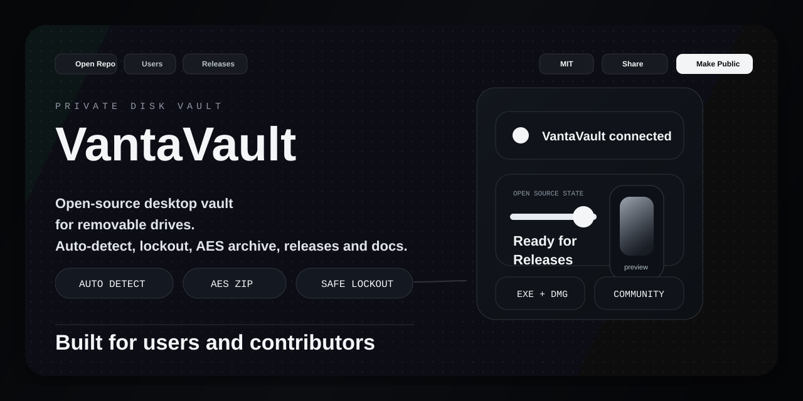
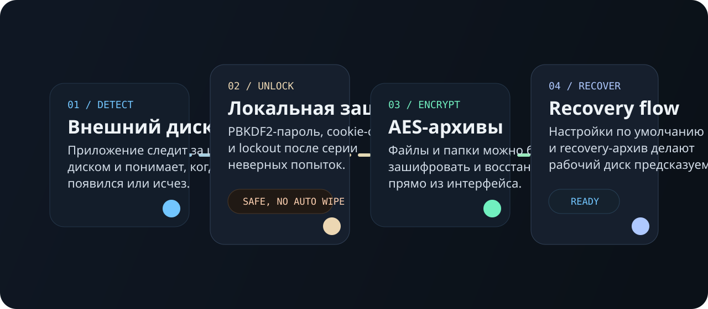

<p align="center">
  
</p>

<h1 align="center">VantaVault</h1>

<p align="center">
  <strong>A premium desktop vault for removable drives.</strong><br>
  Detect the right disk, unlock locally, open your workspace, and create encrypted archives without cloud services or extra noise.
</p>

<p align="center">
  <a href="https://github.com/mitaro-cs/VantaVault/releases/latest">
    
  </a>
  <a href="https://github.com/mitaro-cs/VantaVault/releases/latest">
    
  </a>
  
  
  
  
</p>

<p align="center">
  <a href="#why-vantavault">Why VantaVault</a> ·
  <a href="#download">Download</a> ·
  <a href="#run-from-source">Run From Source</a> ·
  <a href="#product-flow">Product Flow</a> ·
  <a href="#documentation">Documentation</a> ·
  <a href="#open-source">Open Source</a> ·
  <a href="#security-model">Security</a>
</p>

## Why VantaVault

`VantaVault` is built for one very specific job: giving an external drive a clean,
premium, local-first desktop workflow.

Instead of acting like a generic file helper, the app centers around a target volume:

- it knows when the preferred drive is mounted or missing;
- it keeps access behind a local password and safe lockout flow;
- it opens the right workspace quickly;
- it lets you create and recover local AES archives from the same interface;
- it stays offline and keeps control on the machine.

<table>
  <tr>
    <td width="50%" valign="top">
      <h3>For Users</h3>
      <p>Download a ready-made build, launch it, set a password, choose a preferred disk, and use it like a polished desktop product.</p>
    </td>
    <td width="50%" valign="top">
      <h3>For Builders</h3>
      <p>Clone the repo, run one bootstrap command, and get the same product UI locally with docs, tests, release scripts, and contribution guides.</p>
    </td>
  </tr>
</table>

## Download

The easiest path for most people is `GitHub Releases`.

1. Open [Latest Release](https://github.com/mitaro-cs/VantaVault/releases/latest)
2. Download the file for your system
3. Launch the app

Release assets:

- `VantaVault-vX.Y.Z-macos.dmg`
- `VantaVault-vX.Y.Z-windows-x64.exe`
- `SHA256` files for verification

## Run From Source

If you want to run the project directly from GitHub, the repo now has bootstrap launchers.

### macOS / Linux

```bash
git clone https://github.com/mitaro-cs/VantaVault.git
cd VantaVault
chmod +x main
./main
```

### Windows PowerShell

```powershell
git clone https://github.com/mitaro-cs/VantaVault.git
cd VantaVault
.\main.ps1
```

### Windows Double Click

- open `main.bat`

The bootstrap flow:

- creates `.venv`
- installs desktop dependencies
- launches `VantaVault`
- reuses the environment on later runs

Install only:

```bash
./main --install-only
```

```powershell
.\main.ps1 --install-only
```

## Product Flow

<p align="center">
  
</p>

### Core capabilities

- local password-based access
- preferred disk detection and mount awareness
- notification when the target disk is missing
- auto-focus on the preferred volume
- default settings screen for repeatable behavior
- Finder / Explorer open actions
- local AES archive creation and extraction
- safe lockout instead of destructive auto-wipe
- desktop shell via `pywebview`
- release packaging for `macOS` and `Windows`

## Documentation

Everything important for users and contributors lives in the repo.

| Document | Purpose |
| --- | --- |
| [docs/GETTING_STARTED.md](docs/GETTING_STARTED.md) | quickest way to install and run the app |
| [docs/TROUBLESHOOTING.md](docs/TROUBLESHOOTING.md) | common setup and runtime problems |
| [docs/FAQ.md](docs/FAQ.md) | product and usage questions |
| [SUPPORT.md](SUPPORT.md) | where to ask for help or report issues |
| [CONTRIBUTING.md](CONTRIBUTING.md) | contribution workflow |
| [SECURITY.md](SECURITY.md) | security reporting policy |
| [STYLEGUIDE.md](STYLEGUIDE.md) | shared product UI rules |

## Open Source

This repository is set up to feel like a real public product repo, not just a code dump.

- clear install and release paths
- issue templates and PR template
- docs for users, contributors, and security reports
- release automation for `dmg` and `exe`
- public license and contribution rules

### Useful repo links

- [CONTRIBUTING.md](CONTRIBUTING.md)
- [CODE_OF_CONDUCT.md](CODE_OF_CONDUCT.md)
- [SECURITY.md](SECURITY.md)
- [SUPPORT.md](SUPPORT.md)
- [.github/ISSUE_TEMPLATE/bug_report.yml](.github/ISSUE_TEMPLATE/bug_report.yml)
- [.github/ISSUE_TEMPLATE/feature_request.yml](.github/ISSUE_TEMPLATE/feature_request.yml)
- [.github/pull_request_template.md](.github/pull_request_template.md)

## Build And Release

<details>
  <summary><strong>Build macOS DMG</strong></summary>

```bash
git clone https://github.com/mitaro-cs/VantaVault.git
cd VantaVault
./scripts/build_mac.sh
```

Output:

```text
release/VantaVault-mac.dmg
```
</details>

<details>
  <summary><strong>Build Windows EXE</strong></summary>

- local Windows build: `scripts/build_windows.ps1`
- GitHub automation: `.github/workflows/release.yml`
</details>

<details>
  <summary><strong>Create a GitHub Release</strong></summary>

```bash
git tag v0.2.0
git push origin v0.2.0
```

The workflow builds versioned `dmg` and `exe` files and uploads them to the release page.
</details>

## Security Model

- password storage uses local `PBKDF2-SHA256`
- the UI is protected by a local cookie session
- repeated failed passwords trigger temporary lockout
- destructive auto-wipe is intentionally not used
- AES archives are created locally
- the app does not send your vault data to external services

If you find a vulnerability, use [SECURITY.md](SECURITY.md) instead of posting exploit details in a public issue.

## Repository Layout

| Path | Purpose |
| --- | --- |
| `app.py` | local backend, disk logic, auth state, lockout, AES archives |
| `desktop.py` | desktop launcher based on `pywebview` |
| `main` / `main.ps1` / `main.bat` | one-step local launchers |
| `web/` | product UI |
| `assets/` | GitHub visuals and generated assets |
| `docs/` | user and contributor documentation |
| `scripts/` | build, bootstrap, cleanup, icons |
| `tests/` | unit tests |

## Verification

Quick local check:

```bash
python3 -m py_compile app.py desktop.py scripts/bootstrap.py tests/test_app.py
python3 -m unittest discover -s tests -v
```

## License

Released under the `MIT` license. See [LICENSE](LICENSE).
