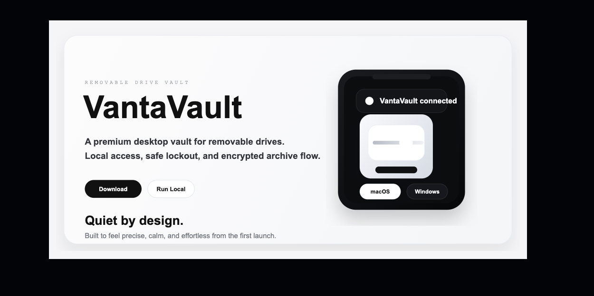
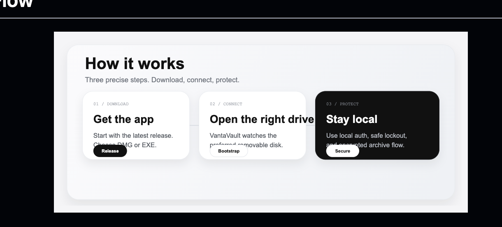
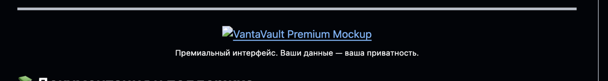

---

## 🚀 Начать прямо сейчас

<p align="center">
  <a href="https://github.com/mitaro-cs/VantaVault/releases/latest" style="display:inline-block;margin:0 10px;">
    
  </a>
  <a href="#как-запустить" style="display:inline-block;margin:0 10px;">
    
  </a>
</p>

---

## 📱 Как это работает



**Три простых шага:**

1. **DOWNLOAD** — Скачай последнюю версию (macOS или Windows)
2. **CONNECT** — Подключи внешний диск и открой VantaVault
3. **PROTECT** — Защити свои файлы локально. Без облака. Без рисков.

---

## ✨ Что тебе нужно знать



### 🔒 Локальная безопасность
Только локальная аутентификация. Всё на твоём диске. Без облачных сервисов.

### 💾 Умное управление дисками
VantaVault автоматически определяет твой внешний диск и всегда готов к защите.

### 🔐 Шифрование архивов
Создавай и восстанавливай зашифрованные архивы прямо из приложения.

---

## 📥 Установка

### macOS
```bash
# 1. Скачай VantaVault-mac.dmg
# 2. Откройте DMG-файл
# 3. Перетащи VantaVault в Applications
# 4. Готово!
```

### Windows
```bash
# 1. Скачай VantaVault-windows-x64.exe
# 2. Запусти установщик
# 3. Следуй подсказкам на экране
# 4. Готово!
```

---

## 🛠 Как запустить

### Из исходников (macOS / Linux)

```bash
git clone https://github.com/mitaro-cs/VantaVault.git
cd VantaVault
chmod +x main
./main
```

### Из исходников (Windows)

```powershell
git clone https://github.com/mitaro-cs/VantaVault.git
cd VantaVault
.\main.ps1
```

Или просто откройте `main.bat` в проводнике.

---

## 📚 Документация

- [🚀 Быстрый старт](docs/GETTING_STARTED.md)
- [❓ Часто задаваемые вопросы](docs/FAQ.md)
- [🆘 Техническая поддержка](SUPPORT.md)
- [💪 Внести вклад](CONTRIBUTING.md)
- [🔒 Информация о безопасности](SECURITY.md)

---

## 🛡 Безопасность

Мы серьёзно относимся к твоей приватности:

- **PBKDF2-SHA256** — Локальное хранение паролей
- **Session Protection** — Защита сессии и временная блокировка
- **AES Encryption** — Зашифрованные локальные архивы
- **No Cloud** — Ничего не отправляется на серверы

Подробнее в [SECURITY.md](SECURITY.md)

---

## 📜 Лицензия

VantaVault распространяется под лицензией **MIT**. Полностью свободно и открыто.

Смотреть [LICENSE](LICENSE)

---

<p align="center">
  <br>
  <strong>Сделано с ❤️ для защиты твоей приватности</strong><br>
  <sub><a href="https://github.com/mitaro-cs/VantaVault">GitHub</a> • <a href="CONTRIBUTING.md">Помочь проекту</a></sub>
</p>
